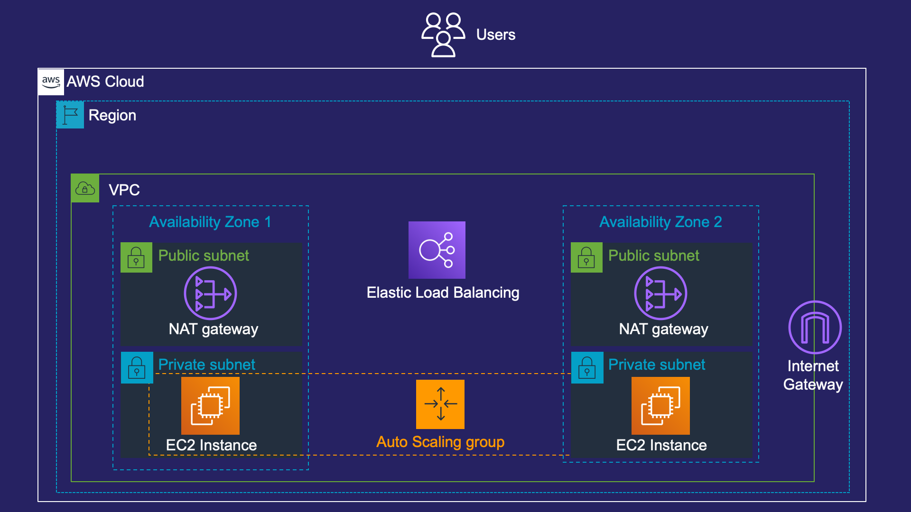

## [_Let's Ship It — with AWS_](https://pages.awscloud.com/global-traincert-twitch-lets-ship-it-with-aws.html)

### **Episode 3: Get Ready for Scale**
Do you know how to ensure that your application components can scale quickly to be reliable and available? Join us to learn more.

- [Watch on-demand](https://www.twitch.tv/videos/1147625427)

### **AWS CloudFormation**
Deploy [this](episode-3-cloudformation.yml) AWS CloudFormation template to provision the resources shown in the stream for yourself. Charges may apply for the resources deployed, and will continue to be charged if you do not remove them. 

## Security

See [CONTRIBUTING](CONTRIBUTING.md#security-issue-notifications) for more information.

## License

This library is licensed under the MIT-0 License. See the LICENSE file.

