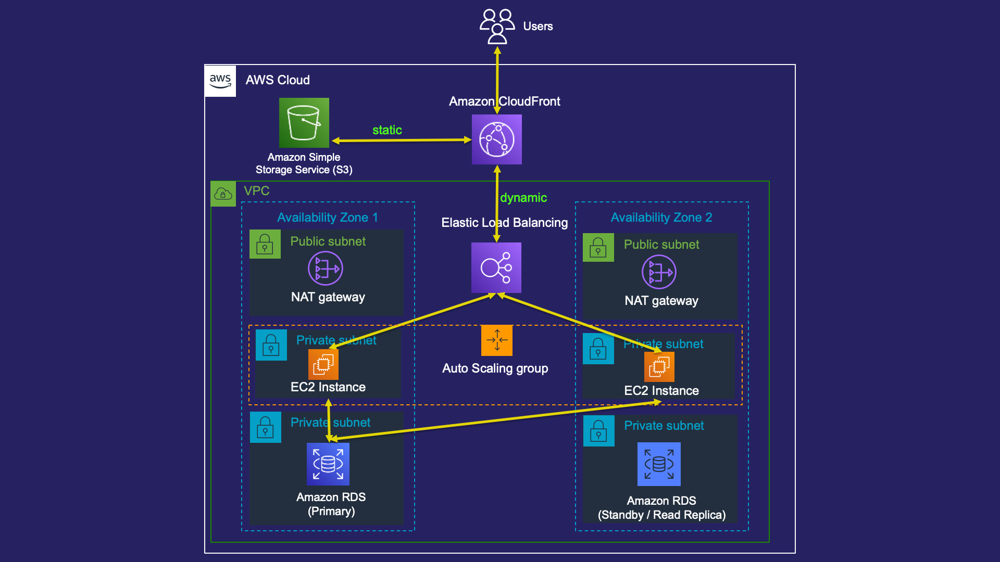

## [_Let's Ship It — with AWS_](https://pages.awscloud.com/global-traincert-twitch-lets-ship-it-with-aws.html)

### **Episode 5: Production Readiness**
Our application is now running in a highly available and secure manner. In this episode, we will talk about some key concepts to help you ensure that your application is ready for prime time: distribution, fault tolerance, and cost analysis.

- [Watch on-demand](https://www.twitch.tv/videos/1160807752)

### **AWS CloudFormation**
This episode's infrastructure as code is a little more involved, as we need to create an Amazon Machine Image (AMI) to deploy for our application. 
You will need to follow these steps to create your AMI before deploying the CloudFormation template.
1. Create an Amazon EC2 instances using the most recent Amazon Linux 2 base AMI. 
   + Feel free to put this in any VPC (default is fine)
   + [Make sure that you can connect to the instance](https://docs.aws.amazon.com/AWSEC2/latest/UserGuide/Connect-using-EC2-Instance-Connect.html)
2. Once the instance is created and you are connected, copy and paste the commands from [episode-5-build-ami.sh](episode-5-build-ami.sh). 
3. Once you have run those commands, [create an AMI from this EC2 instance](https://docs.aws.amazon.com/toolkit-for-visual-studio/latest/user-guide/tkv-create-ami-from-instance.html).
4. Take note of the AMI ID that is created, and we'll use that in our CloudFormation template.

Once you have the AMI created from the steps above, you can deploy [the CloudFormation template](episode-5-cloudformation.yml) just like the previous episodes, making sure to enter the AMI ID that you just created into the CloudFormation Parameters.
As always, charges may apply for the resources deployed, and will continue to be charged if you do not remove them. 

## Security

See [CONTRIBUTING](CONTRIBUTING.md#security-issue-notifications) for more information.

## License

This library is licensed under the MIT-0 License. See the LICENSE file.

